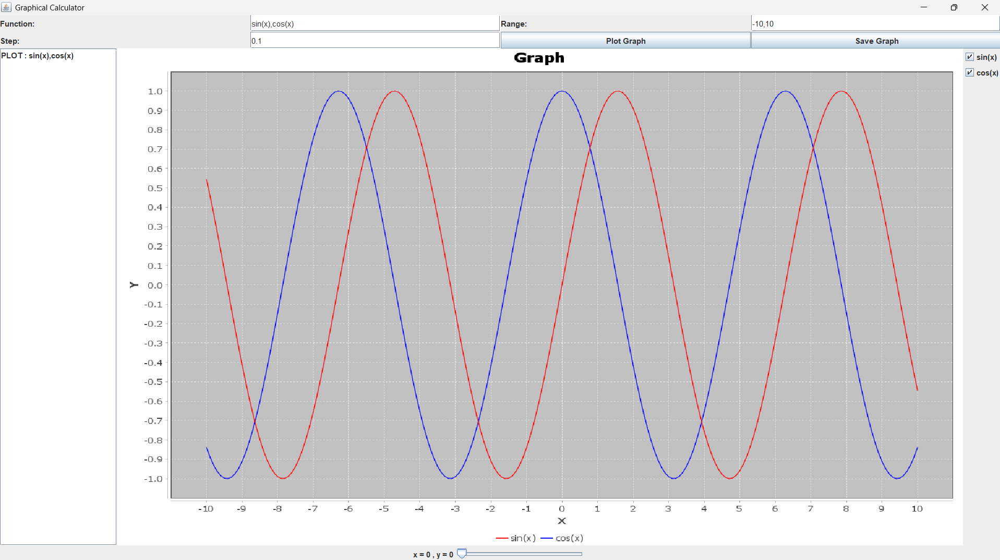

# Graphical Calculator

A desktop-based Graphical Calculator built using Java Swing that supports multi-function graph plotting, interactive selection, history tracking, and dark mode UI.

## Screenshot



## Features

- Multi-function graph plotting (e.g., sin(x), cos(x), x^2)
- Checkbox-based function selection (show/hide graphs dynamically)
- History tracking of previous plots
- Double-click history to reload function
- Interactive slider for real-time (x, y) values
- Dark mode UI toggle
- Save graph as PNG image

## Technologies Used

- Java
- Swing (GUI)
- JFreeChart (Graph plotting)
- exp4j (Expression evaluation)
- File handling (CSV + history storage)

## Project Structure

```
src/           Java source files
lib/           External libraries (JFreeChart, exp4j)
bin/           Compiled class files
screenshots/   UI screenshots
graph.png      Exported graph image
data.csv       Function data output
```

## Compile

```bash
javac -cp "lib/*" -d bin src/*.java
```

## Run

```bash
java -cp "bin;lib/*" GraphicalCalculator
```

## Example Input

```bash
sin(x), cos(x), x^2
```

## Output

- Multiple graphs displayed on same chart
- Each function has different color
- Functions can be toggled using checkboxes


## Future Improvements

- Real-time graph updates (no Plot button required)
- Zoom and pan support
- Function editing directly on graph
- Maven build system integration
- Export as executable JAR
- Web version using React + backend


## Author

Rohit Rajana
Java CSE Project — Graphical Calculator